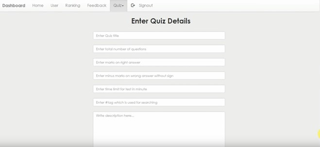

# IntelliTest Proctor: Advanced Online Assessment Platform
The IntelliTest Proctor is a web-based platform designed to streamline the process of conducting examinations remotely. It aims to provide a secure, efficient, and user-friendly environment for both administrators and examinees. This system eliminates the traditional paper-based examination methods, offering numerous benefits such as flexibility in scheduling exams, instant result generation, and reduced administrative overhead

### Objectives

1. **Data Management**:
   - Ensure secure storage and management of examination data, including questions, answers, user details, feedback, and results.

2. **User Authentication and Authorization**:
   - Implement a secure login system to authenticate users (students, instructors, administrators) before accessing the system.
   - Utilize Role-based access control to restrict functionalities based on user roles (e.g., students can take exams, instructors can create exams, administrators can manage users and exams).

3. **Exam Creation and Management**:
   - Provide an intuitive interface for instructors to create, edit, and manage exams.
   - Support various types of questions such as multiple-choice.
   - Allow setting parameters for exams such as time limits and grading criteria.

4. **Scoring and Feedback**:
   - Automatically score objective questions and provide instant feedback to students upon exam completion.
   - Generate detailed performance reports for both students and instructors.

5. **Security and Integrity**:
   - Implement encryption techniques to secure sensitive data such as user credentials and exam content.
   - Ensure the login system is present and secured by passwords.
   - Provide the ability to save the given answers to maintain integrity.
     
### Software Specification

- **Project Type**: Web-Based Application
- **Front-end Technologies**: HTML, CSS, JavaScript
- **Database Tool**: MySQL
- **Back-end Technology**: PHP
- **Operating Systems**: Compatible with Windows 8 and above, Linux, and Mac
- **Browsers**: Compatible with Internet Explorer, Chrome, Firefox, Microsoft Edge, or Safari
- **Software**: MySQL Command Line
 

**HomePage**   

**Login Page**   

**Feedback Page**   

**Quiz Page**   

**Quiz Details**   

